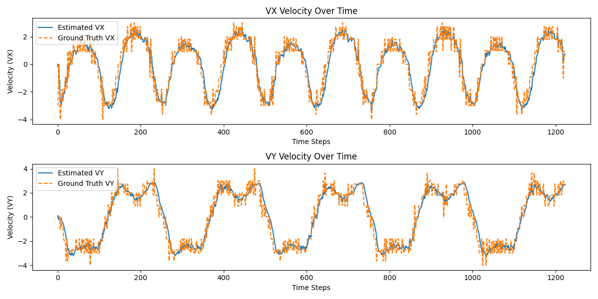

# Extended Kalman Filter (EKF) for Ground Bot Tracking

This repository contains both C++ and Python implementations for tracking a ground bot using the Extended Kalman Filter (EKF). It fuses Lidar and Radar sensor data to estimate the bot’s position and velocity.

## Table of Contents
- [Introduction](#introduction)
- [Features](#features)
- [Folder Structure](#folder-structure)
- [Prerequisites](#prerequisites)
- [Usage](#usage)
  - [C++ Version](#c-version)
  - [Python Version](#python-version)
- [File Format](#file-format)
- [Results](#results)
- [Future Aspects](#future-aspects)
- [References](#references)

## Introduction

- **Algorithm**: Extended Kalman Filter (EKF) for state estimation in non-linear systems.
- **Application**: Tracking moving objects like ground bots in various environments.
- **Data Fusion**: Combines noisy Lidar (distance measurements) and Radar (motion detection) data.
- **Process**: 
  - **Prediction**: Forecasts the next state based on current state and dynamics.
  - **Update**: Refines predictions with new measurements to minimize uncertainties.
- **Objective**: Evaluate EKF performance against ground truth for improved autonomous navigation and robotics.


## Features
- Fusion of Radar and Lidar sensor data.
- Non-linear state estimation using the Extended Kalman Filter.
- Comparison of estimated values against ground truth data.
  
## Folder Structure
    
    EKF_Tracking_Of_Ground_Bot/
    ├── EKF_Cpp/                  # C++ implementation
    │   ├── build/                # You need to build this directory for compilation of all C++ files
    │   └── data/                 # Contains the input files
    │   └── src/                  # All C++ code and header files
    
    ├── EKF_Python/               # Python implementation
    │   ├── Script/               # Python code
    │   └── data/                 # Input files for the Python version
    │   └── Output/               # Output folder for results

## Prerequisites

### Python Implementation:
- **Python version**: Python 3.6 or higher is required.
- **Necessary libraries**: You will need the following Python libraries for the EKF implementation:
  - `numpy` for matrix operations and numerical computations.
  - `matplotlib` for plotting results (optional, if you want to visualize the tracking performance).
  - `pandas` (optional, for handling data input/output in a structured way).

- To install these packages, run the following commands:

    ```bash
    pip install numpy
    pip install matplotlib     # Optional, for visualizing tracking results
    pip install pandas         # Optional, for data handling


### C++ Implementation:
- **C++ version**: C++11 or higher.
- **Build system**: You need `cmake` to configure the project.
- **Compiler**: Use `g++` or `clang++` for compilation.

- To ensure your system meets these requirements, you can install `cmake` and the compiler using the following commands (for **Ubuntu/Debian-based systems**):

    ```bash
    sudo apt-get update
    sudo apt-get install cmake g++
- For other operating systems, use the equivalent package manager (e.g., **brew for macOS**, **choco for Windows**).

## Usage

### C++ Version
1. Navigate to `EKF_Cpp/`.
2. Build the project:
   ```bash
   mkdir build
   cd build
   cmake ..
   make                # this make will do compile all the cpp files
   ./EKF_Tracking ../data/input.txt ./output.txt

- This command `make` triggers the build system to compile all the C++ source files located in the src/ directory. It will generate an executable file that runs the Extended Kalman Filter (EKF) for ground bot tracking. The make process ensures that all necessary object files are created, linked, and optimized according to the CMake configuration. After compiling, the resulting executable can be run with the input data to perform state estimation using fused Lidar and Radar measurements.

 ### Python Version
1.⁠ ⁠Navigate to ⁠ `EKF_Python/Script/` ⁠.
2.⁠ ⁠Run the Python script:
    
    python3 main.py
•⁠  ⁠Ensure that the Input.txt is present in EKF_Python/data/

## File Format:
### The Input file format is:
     L(for laser) meas_px meas_py timestamp gt_px gt_py gt_vx gt_vy
     R(for radar) meas_rho meas_phi meas_rho_dot timestamp gt_px gt_py gt_vx gt_vy

     Example:
        R	8.60363	0.0290616	-2.99903	1477010443399637	8.6	0.25	-3.00029	0
        L	8.45	0.25	1477010443349642	8.45	0.25	-3.00027	0
### The Output file format is:
    est_px est_py est_vx est_vy meas_px meas_py gt_px gt_py gt_vx gt_vy

    Example:
        4.53271	0.279	-0.842172	53.1339	4.29136	0.215312	2.28434	0.226323
        43.2222	2.65959	0.931181	23.2469	4.29136	0.215312	2.28434	0.226323
- Here
    - est_px, est_py: Estimated x and y positions.
    - est_vx, est_vy: Estimated velocities in x and y directions.
    - meas_px, meas_py: Measured x and y positions (from sensors like Lidar or Radar).
    - gt_px, gt_py: Ground truth x and y positions.
    - gt_vx, gt_vy: Ground truth velocities in x and y directions.

## Results
The output of the EKF will be saved in ⁠ Output/output.txt for python and build/output.txt for C++ ⁠. The results will include the estimated position and velocity alongside the ground truth for evaluation.

## Visualizing the Results

We use `matplotlib` to visualize the EKF's performance by plotting estimated positions, velocities, and errors against ground truth and sensor measurements. Follow the steps below to generate these plots.

### Position Visualization

The plots illustrate **X** and **Y** positions and velocities over time, featuring:


- **Noisy Sensor Data (Green Dotted Line)**: 
  - Measured values (`meas_px`, `meas_py`, `meas_vx`, `meas_vy`) from Lidar and Radar, exhibiting fluctuations due to sensor noise.

- **Ground Truth (Orange Dashed Line)**: 
  - Actual positions (`gt_px`, `gt_py`) and velocities (`gt_vx`, `gt_vy`) of the ground bot, serving as smooth reference lines.

- **Estimated Position (Blue Solid Line)**: 
  - Positions (`est_px`, `est_py`) and velocities (`est_vx`, `est_vy`) computed by the EKF, which filter out noise to closely follow the ground truth.


### Velocity Visualization



This plots include:

- **Estimated Velocity (Blue Solid Line)**: 
  - Represents computed velocities (`est_vx`, `est_vy`) by the EKF, tracking closely to ground truth velocities (`gt_vx`, `gt_vy`).

- **Ground Truth Velocity (Orange Dashed Line)**: 
  - Actual velocities represented as smooth lines.

- **Measured Velocity (Green Dotted Line)**: 
  - Noisy measured velocities (`meas_vx`, `meas_vy`) from sensors.

### Error Visualization


Error plots illustrate discrepancies between estimated and ground truth values:

- **Position Error**: 
  - Difference between estimated and ground truth positions, indicating EKF accuracy.

- **Velocity Error**: 
  - Difference between estimated and ground truth velocities, crucial for assessing filter performance.

### Explanation of Results

- **Kalman Filter's Strength**: 
  - The EKF refines predictions by integrating sensor input, aligning estimated values (blue) with ground truth (orange).

- **Measurement Noise**: 
  - Jagged green lines reveal inaccuracies in sensor data, leading to oscillations around the ground truth.

- **Smooth Estimates**: 
  - The EKF produces smoother estimates, as the blue line remains close to the orange line, compensating for sensor noise.

### Conclusion

- Green dotted lines indicate noisy measurements.
- Orange dashed lines depict the actual trajectory and velocity.
- Blue solid lines effectively track the ground truth, smoothing out sensor noise.
- Error plots provide insights into the accuracy of position and velocity estimates, showcasing EKF performance.


## Future Aspects
- **GPS Integration:** Enhance geolocation and navigation through GPS fusion with Lidar and Radar.
- **Machine Learning:** Use algorithms to adaptively refine EKF parameters based on environmental conditions.
- **Additional Sensors:** Incorporate cameras for visual tracking and IMUs for improved motion estimation.
- **Comprehensive System:** Develop a multi-sensor fusion system for advanced autonomous navigation and tracking applications.

## References
-  ⁠[Kalman Filter](https://en.wikipedia.org/wiki/Kalman_filter)
-  ⁠[Radar vs Lidar](https://spectrum.ieee.org/radar-vs-lidar)
